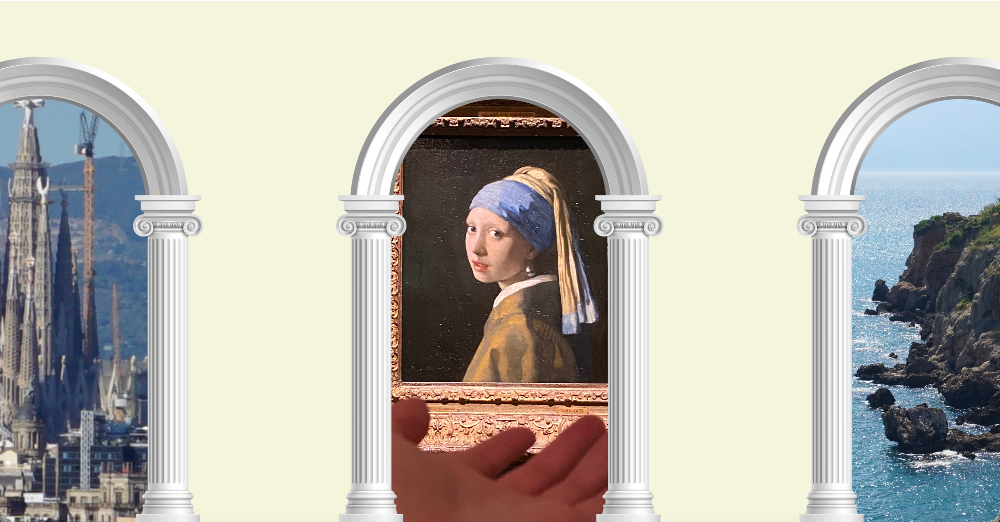

# Arch Carousel

A frontend interaction experiment exploring an infinite horizontal carousel with arch-shaped units — featuring momentum scrolling, snap alignment, and a click-through zoom effect that splits the scene into two independent compositing layers.

## Preview

<video src="assets/Screen Recording.mov" controls width="100%"></video>



## Interaction

- **Infinite scroll** — 15 units loop within a 3-unit cycle; wrapping is transparent to the user
- **Momentum physics** — velocity decays 8% per frame (factor 0.92) for a natural deceleration feel
- **Snap alignment** — once speed drops below 0.15px, the nearest arch eases to center with an 18% spring factor
- **Arrow key control**
  - Single tap → slow snap to the adjacent unit
  - Hold → continuous scroll at ±5px/frame
- **Hover lift** — hovering over the centered arch for 200ms triggers a subtle scale-up (`scale(1.03)`); leaving reverses it
- **Click zoom-through** — clicking the centered arch triggers a full-screen zoom animation (see below)

## Click Zoom-Through: Two-Layer Compositing

Clicking the centered arch splits the scene into two independently animated layers:

**Upper layer — Viewport scales up (z-index: 100)**

Contains all non-content elements: the arch image, corner filler SVG, side fillers, and supplemental masks. Animates from `scale(1)` to `scale(8)` from the viewport center, creating the sensation of physically passing through the arch.

Two sets of masks are created inside the viewport and scale with it:

- **Wide side curtains** (direct children of viewport, z-index: 6) — extend from the screen edges to the arch content boundary, masking adjacent arch units during zoom
- **Pillar backing masks** (inserted into the arch-unit, z-index: 2) — beige rectangles behind the arch image covering the lower pillar areas on both sides, preventing lower-layer content from showing through any transparency in the arch photo

**Lower layer — Content container expands (z-index: 1)**

The clicked `content-container` is detached from the arch-unit and re-mounted directly on `body`. Its position stays fixed; only the container dimensions transition from the original arch rect to full screen over 1s. The image compensates with an offset so it remains visually stationary — the world opens up around it.

## Arch Container: 3-Layer Compositing

Each arch unit is built from three stacked layers:

**Layer 1 — Content Container** `z-index: 1`

A single unified "arch doorway" shape — an arched top connected to a rectangular body below — clipped by one compound `clip-path` path. This is the primary content area; images or any UI element placed here are clipped naturally to the arch form. Content cycles across 3 units per loop.

**Layer 2 — Filler Corner SVG** `z-index: 3`

A beige SVG mask shaped as a full rectangle minus the arch cutout. It covers the corners around the arch opening, giving Layer 1's rectangular container a clean arch silhouette without requiring a transparent image asset.

**Layer 3 — Arch Image** `z-index: 4`

The arch photo, composited on top to complete the final appearance.

> The `clip-path` path on Layer 1 and the SVG cutout on Layer 2 are mathematically complementary — their edges align precisely at any screen size, as both are computed dynamically in JS from the same set of coordinates.

## Responsive Sizing

All dimensions are calculated at runtime to fit any viewport:

```
archHeight  = viewport height × 99%
archWidth   = archHeight × (image natural width / height)
unitWidth   = archWidth + viewport width × 10%
```

## Tech Stack

Vanilla HTML + CSS + JavaScript — no dependencies, no build step.

- `clip-path: path()` for the compound arch container shape
- SVG Bézier arc path for the corner mask cutout
- `requestAnimationFrame` driving momentum, snap, and loop logic
- `will-change: transform` for GPU-accelerated scrolling

## File Structure

```
arch-carousel/
├── assets/                   # preview screenshots and recordings
├── content/                  # all image assets
│   ├── img.webp              # arch image
│   ├── content_1.JPG
│   ├── content_2.PNG
│   └── content_3.JPG
├── src/main.ts               # TypeScript source
├── dist/main.js              # compiled output
├── index.html                # markup only
├── style.css                 # all styles
├── tsconfig.json
└── package.json
```

## Running

Open `index.html` with any static file server — no build required.
