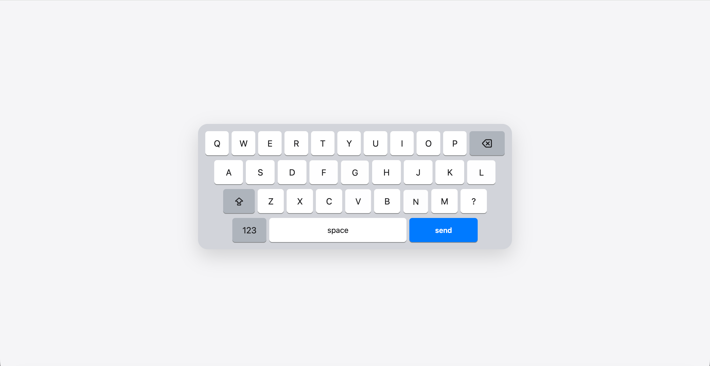
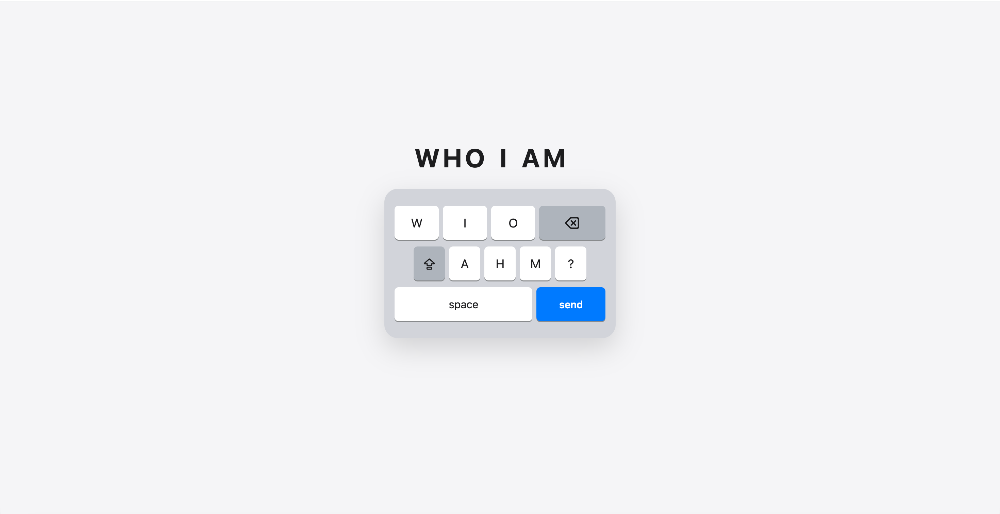

# Keyboard Demo

An interactive animation demo simulating an Apple-style mobile keyboard. Pure front-end, zero runtime dependencies.

---

## Preview

<video src="https://github.com/user-attachments/assets/deb9d54a-b0fe-4c3b-a619-f478c005a448" controls autoplay muted loop width="100%"></video>

| Keyboard transform | Typing result |
|---|---|
|  |  |

---

## What It Does

The animation plays automatically in two phases:

**Phase 1 · Keyboard Transform**
The keyboard opens at full size with four rows. Most keys then scatter and disappear at random, while the surviving keys smoothly reflow into a compact three-row layout using the FLIP animation technique — all in sync with the keyboard shrinking to a narrower width.

**Phase 2 · Mouse Typing**
Once the transform settles, a mouse cursor flies in from outside the keyboard and clicks through the keys to spell out **WHO I AM**. Each keystroke triggers a realistic press animation, and each character appears above the keyboard one by one. After the last letter, the cursor briefly drifts outside the keyboard boundary before returning to click the send button, ending the sequence.

---

## File Structure

```
keyboard/
├── index.html      # Markup
├── style.css       # Styles
├── script.ts       # Source logic (TypeScript)
├── script.js       # Compiled output — generated by tsc, do not edit manually
├── tsconfig.json   # TypeScript compiler config
└── package.json    # Project config
```

---

## Running Locally

Open `index.html` directly in a browser — no dev server needed.

---

## Development

### Install dependencies

```bash
npm install
```

### Compile TypeScript

```bash
npm run build      # compile once
npm run watch      # watch for changes and recompile automatically
```

> Edit `script.ts`, run `build`, then refresh the browser to see updates.

---

## Customisation

### Timing & speed

All timing values are grouped in the `T` object at the top of `script.ts`. Edit and recompile to take effect:

```typescript
const T: TimingConfig = {
    startDelay:    200,   // delay before the animation starts (ms)
    phase2Delay:   1550,  // gap between keyboard transform and typing (ms)

    cursorMove:    203,   // wait after moving cursor to a key — keep in sync with CSS 0.19s
    keyDown:        42,   // key press → character appears (ms)
    keyHold:        54,   // character appears → key release (ms)
    keyGap:         72,   // key release → move to next key (ms)

    endOutside:    384,   // total dwell time outside the keyboard after typing (ms)
    endArriveSend: 225,   // wait after cursor reaches the send key (ms)
};
```

> When changing `cursorMove`, also update the `transition` duration for `left` and `top` on `#type-cursor` in `style.css` to match.

### Typing sequence

Edit the `TYPING_SEQ` array in `script.ts`. `k` is the `data-k` attribute of the target key; `ch` is the character to display:

```typescript
const TYPING_SEQ: TypingStep[] = [
    { k: 'w', ch: 'W' },
    { k: 'h', ch: 'H' },
    // ...
];
```

Available key identifiers are the `data-k` values on each `.key` element in `index.html`.

### Keys to keep

`KEEP_KEYS` controls which keys survive the transform. All others vanish during Phase 1:

```typescript
const KEEP_KEYS: string[] = ['w', 'i', 'o', 'a', 'h', 'm', '?', 'space', 'send', 'delete', 'caps'];
```

---

## How It Works

### FLIP animation

When the keyboard collapses from four rows to three, some keys move across parent elements (`caps`, `M`, `?` migrate from row 3 into row 2). Because CSS `transition` cannot track position changes caused by DOM re-parenting, the **FLIP** technique is used instead:

1. **First** — record each surviving key's `getBoundingClientRect()` before any changes
2. **Last** — move the DOM nodes and add the `shrunk` class; the browser computes the final layout
3. **Invert** — instantly reposition each key back to its visual starting point using `transform: translate + scale`
4. **Play** — on the next frame, remove the transform and let CSS transition carry each key smoothly to its new position

### Key press feedback

To simulate the feel of a real keyboard, the key's `transition` is overridden inline to an extremely short duration (`0.05s`) at the moment of press. Three visual changes fire together — `scale(0.88)`, shadow removal, and a darker background — and all revert automatically on release.

---

## Browser Support

Uses only standard Web APIs (`getBoundingClientRect`, `requestAnimationFrame`, CSS `transition`). Works in all modern browsers with no polyfills required.
