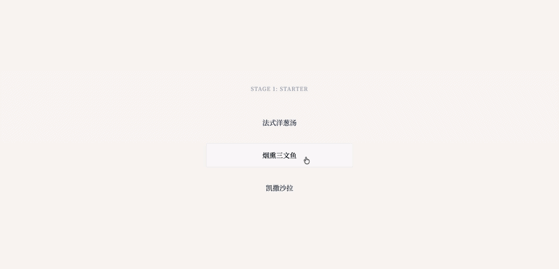

# Minimalist Bistro

A minimal restaurant ordering demo. Guides the user through starter → main course → dessert, then ejects a receipt from a toaster slot with a spring animation.

## Demo



## Features

- Step-by-step menu — one choice per screen
- Slide-in entrance and fade-out exit animations on each option
- Token drop animation simulates "dropping in" a selection
- Receipt rises from the toaster slot with an elastic overshoot
- All copy, paper size, and currency are configured via `data.json` — no code changes needed

## Project Structure

```
minimalist-bistro/
├── index.html          # Pure structural template — no hardcoded copy
├── style.css           # All styles and animation state classes
├── data.json           # Menu data and UI copy configuration
├── src/                # TypeScript source
│   ├── types.ts        # Type definitions
│   ├── constants.ts    # Animation timings and CSS class name constants
│   ├── state.ts        # Application state
│   ├── utils.ts        # Utility functions
│   ├── renderer.ts     # DOM rendering
│   └── animations.ts   # Animation orchestration
└── dist/               # Compiled output (tsc)
```

**Layering rule:** HTML is a pure template. CSS owns all visual states including animations. JS only toggles class names. All copy has a single source of truth in `data.json`.

## Running Locally

Requires an HTTP server — `data.json` is loaded via `fetch` and needs a same-origin context:

```bash
npx serve .
# or
python3 -m http.server
```

Then open `http://localhost:3000` (or whichever port is shown).

## Build

```bash
npm install
npm run build   # compile src/ → dist/ via tsc
npm run watch   # watch mode
```
